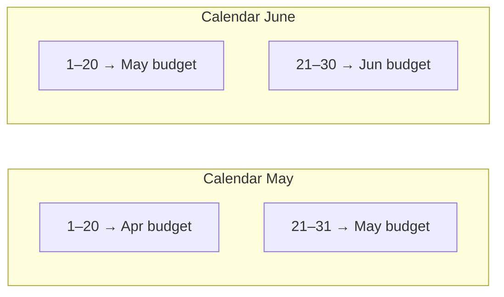

# Budget month rule

Each **budget month** runs from the **21st of one calendar month through the 20th of the next**.

This matches a common pay-cycle or billing-period mental model: late-month spending counts toward the month you are "in" financially.

---

## Mapping rule

| Expense date (day of month) | Budget month |
|----------------------------|--------------|
| **21 – 31** (or last day) | Same calendar month |
| **1 – 20** | Previous calendar month |

### Examples

| Expense date | Budget month |
|--------------|--------------|
| `2026-05-25` | `2026-05` |
| `2026-05-20` | `2026-04` |
| `2026-06-05` | `2026-05` |
| `2026-06-21` | `2026-06` |



---

## Where it is applied

| Component | Behaviour |
|-----------|-----------|
| `expense_data.budget_month()` | Core mapping function |
| `monthly_summary.py --month` | Filters by budget month |
| Dashboard dropdown | Groups and filters by budget month |

The `date` column in CSV always stores the **actual transaction date**. The budget month is computed — never stored as a separate column.

---

## Practical impact

For May budget month (`--month 2026-05`), you include:

- All expenses dated **May 21 – May 31**
- All expenses dated **June 1 – June 20**

June budget month starts with expenses dated **June 21** onward.

---

## Implementation reference

```python
def budget_month(expense_date: datetime) -> str:
    if expense_date.day > 20:
        return expense_date.strftime("%Y-%m")
    # ... previous calendar month
```

See `scripts/expense_data.py` for the full function.
