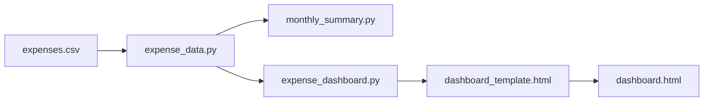

# Systems

Python modules and scripts that power summaries and the dashboard.

| Component | Role |
|-----------|------|
| [Expense data](expense-data.md) | Shared CSV parsing and budget month logic |
| [Scripts](scripts.md) | CLI entry points |

All scripts are stdlib-only — no `pip install` required for reporting.
