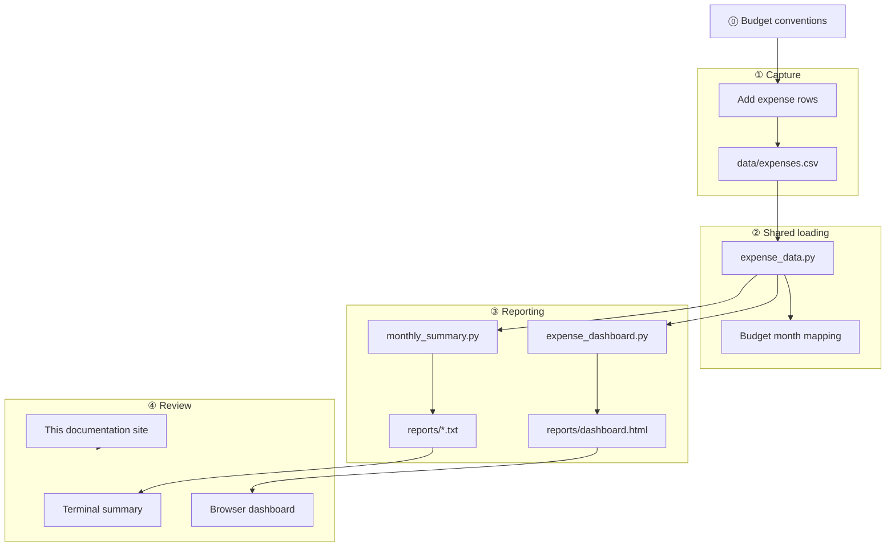

# Personal budget documentation

Welcome to the documentation for this **local-first personal budget** project: manual expense logging in CSV, budget-month rules, text summaries, and an interactive dashboard.

For folder paths see [Where data lives](where-data-lives.md). For step-by-step procedures see [Workflows](workflows/index.md).

---

## End-to-end data flow

The diagram runs from **capture** (adding rows to CSV) through **shared loading** to **reports** (text summaries and HTML dashboard). **Click a box** in the diagram (desktop) or use the step reference table below.

**Versioning:** keep `data/expenses.csv` as the single source of truth; generated files under `reports/` can be regenerated at any time — do not treat them as the only copy of your data.



### Step reference (clickable links)

| Step | What happens | Documentation |
|------|--------------|---------------|
| **⓪ Budget conventions** | 21st–20th budget months; category naming | [Budget month rule](rules/budget-month.md) |
| **① Add expense rows** | One CSV row per purchase, positive amounts | [Add expenses](workflows/add-expenses.md) |
| **`data/expenses.csv`** | Single ledger file on disk | [Where data lives](where-data-lives.md) |
| **`expense_data.py`** | Parse CSV, validate fields, compute budget month | [Expense data](systems/expense-data.md) |
| **`monthly_summary.py`** | Category totals for one or all budget months | [Monthly summary](workflows/monthly-summary.md) |
| **`expense_dashboard.py`** | Build interactive HTML with charts and metrics | [Dashboard workflow](workflows/dashboard.md) |
| **`reports/*.txt`** | Optional saved terminal output | [Where data lives](where-data-lives.md#reports) |
| **`reports/dashboard.html`** | Charts, KPIs, recent transactions | [Interactive dashboard](dashboard.html) |

---

## Overview

This project currently spans:

- **Capture** — manual rows in `data/expenses.csv`
- **Classification** — free-form categories and [budget month](rules/budget-month.md) assignment
- **Summaries** — terminal reports via `monthly_summary.py`
- **Visualization** — HTML dashboard via `expense_dashboard.py`
- **Documentation** — this site (Material for MkDocs), modeled after the [NMCB hand-over documentation](https://nmcb-fair.github.io/nmcb-handover-docs/)

There is no database, no cloud sync, and no Python package dependencies for the core scripts.

---

## Architecture principle

**One source of truth.** Every report and chart should trace back to `data/expenses.csv`. Generated outputs under `reports/` are disposable; the CSV is not.

Every workflow should make it possible to answer:

- Where did this amount come from?
- Which budget month does this expense belong to?
- Can I regenerate this report from the CSV alone?

---

## Keep in mind (privacy and backups)

These habits apply to **every** export, backup, or share of budget data.

### Minimize what you share

- Share **only** what someone actually needs (e.g. category totals, not full descriptions).
- Prefer **aggregates** over row-level detail when discussing spending with others.

### Identifiers and notes

- The `description` and `notes` columns may contain personal or sensitive details — treat the CSV like private financial data.
- Do not commit the CSV to a **public** repository unless you are comfortable exposing that information.

### Before you copy or upload anything

1. Is each column **required** for the purpose?
2. Could any field be replaced by a **less detailed** alternative?
3. Is the copy stored in a **location you control** (local disk, private repo)?

---

## How this site is organised

| Section | Purpose |
|---------|---------|
| **[Where data lives](where-data-lives.md)** | Paths for CSV, reports, and scripts |
| **[Site usage](site-usage.md)** | How to run and publish this documentation |
| **[Workflows](workflows/index.md)** | Add expenses, summaries, dashboard generation |
| **[Systems](systems/index.md)** | Python modules and script reference |
| **[Rules](rules/budget-month.md)** | Budget month (21st–20th) convention |
| **[Dashboard (live)](dashboard.html)** | Interactive charts (generated before site build) |

---

## How to use this documentation

Use the **diagram above**, then [Where data lives](where-data-lives.md) and the **workflow** or **system** page for the task at hand.

Each workflow page answers: why it exists; when to do it; where files live; steps; what to check before you are done.

---

## Quick start

```bash
# Terminal summary for May budget month
python3 scripts/monthly_summary.py --month 2026-05

# Regenerate dashboard and open it
python3 scripts/expense_dashboard.py --open

# Serve this documentation locally
pip install -r requirements-docs.txt
python3 scripts/expense_dashboard.py --output docs/dashboard.html
mkdocs serve
```

Then open [http://127.0.0.1:8000](http://127.0.0.1:8000).
